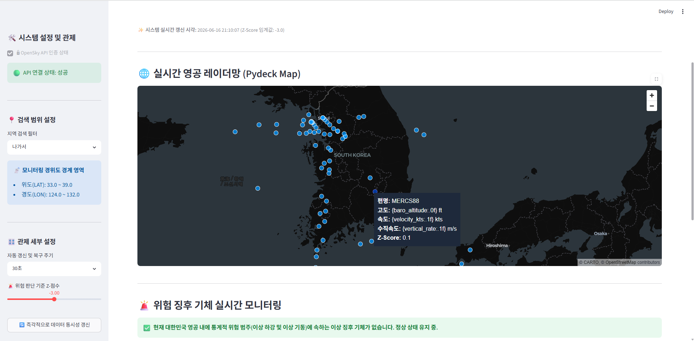

# AI 스마트 항공 관제 

OpenSky Network API를 활용하여 대한민국 영공 내 항공기 정보를 실시간으로 수집하고, 통계 분석을 통해 이상 징후를 탐지하는 웹 기반 관제 시스템입니다.

## 프로젝트 소개

항공기의 위치, 고도, 속도, 수직 속도 등의 데이터를 실시간으로 수집하여 지도 위에 시각화하고, 비정상적인 움직임을 보이는 항공기를 자동으로 탐지할 수 있도록 제작하였습니다.

수집된 항공기들의 수직 속도 데이터를 기반으로 평균과 표준편차를 계산하고, Z-Score 알고리즘을 활용하여 급격한 강하와 같은 이상 징후를 탐지합니다.

## 주요 기능

* OpenSky Network API를 통한 실시간 항공기 데이터 수집
* 대한민국 영공 내 항공기 위치 시각화
* Z-Score 기반 이상 징후 탐지
* 위험 항공기 자동 분류
* Streamlit 기반 웹 대시보드 제공
* Pydeck 기반 인터랙티브 지도
* 항공기 상세 정보 조회
* 실시간 데이터 테이블 제공

## 사용 기술

### Language

* Python

### Framework

* Streamlit

### Data Analysis

* Pandas

### Visualization

* Pydeck

### API

* OpenSky Network API

## 프로젝트 구조

```text
AI-AirTraffic-Dashboard
│
├── app.py
├── run.bat
├── requirements.txt
├── README.md
└── screenshots
```

## 실행 방법

### 1. 라이브러리 설치

```bash
pip install -r requirements.txt
```

또는

```bash
pip install streamlit pandas pydeck
```

### 2. 프로그램 실행

```bash
python -m streamlit run app.py
```

또는

```bash
run.bat
```

## 구현 내용

### 실시간 데이터 수집

OpenSky Network API를 통해 대한민국 영공 내 항공기 정보를 수집합니다.

### 이상 징후 탐지

항공기의 수직 속도 데이터를 기반으로 평균과 표준편차를 계산하고, Z-Score를 활용하여 이상치를 탐지합니다.

### 지도 시각화

정상 항공기와 위험 항공기를 구분하여 지도 위에 표시하고, 선택한 항공기의 상세 정보를 확인할 수 있습니다.

## 개발 과정에서 개선한 부분

* Streamlit 실행 환경 구성
* 지도 렌더링 방식 개선
* 항공기 마커 가독성 향상
* 데이터 표시 방식 개선
* 사용자 인터페이스 최적화

## 프로젝트 화면

프로젝트 실행 화면은 아래 이미지에서 확인할 수 있습니다.


